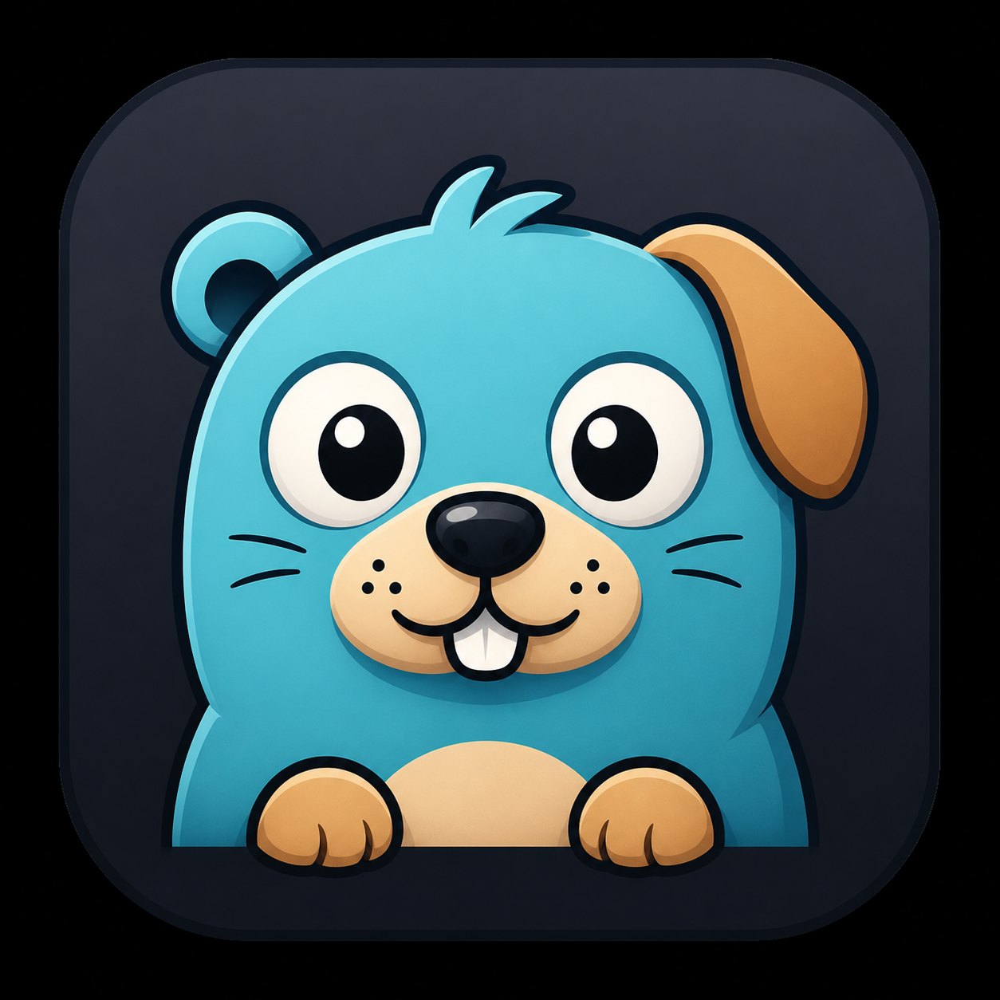
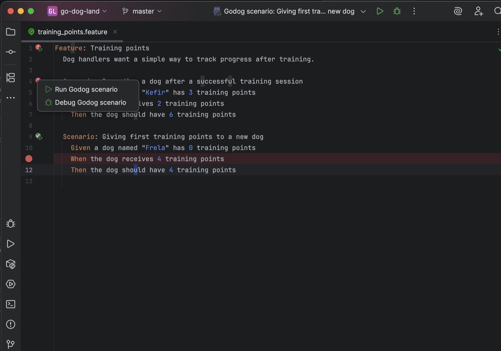
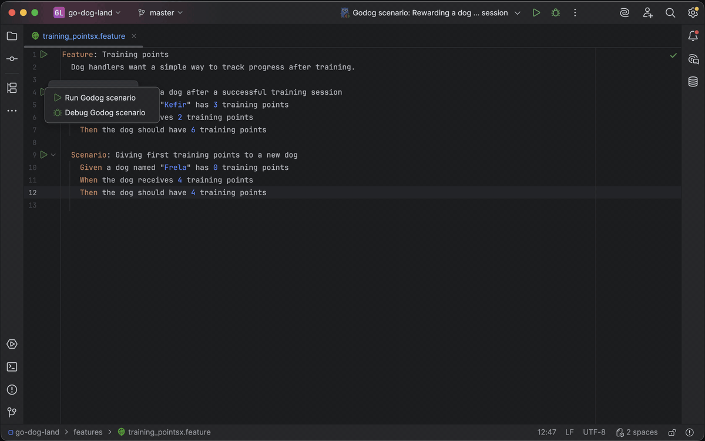

<p align="center">
  
</p>

<h1 align="center">GoDogLand BDD Runner</h1>

<p align="center">
  <strong>Godog and Cucumber workflows that feel native inside GoLand.</strong>
</p>

<p align="center">
  Run, debug, inspect, generate, and navigate BDD scenarios without bouncing between
  your terminal, feature files, and Go step definitions.
</p>

<p align="center">
  
</p>

---

## Why This Exists

BDD in Go is great once it is running. The rough part is everything around it:
finding the right step definition, running one scenario, debugging a failing
example, checking whether a step is still used, and wiring environment variables
for the test command.

GoDogLand BDD Runner brings those daily Godog tasks into the GoLand editor. Your
`.feature` file becomes a real control surface: click a scenario, run it, debug
it, jump to Go code, see the latest status, and keep moving.

## See It In Action

<p align="center">
  
</p>

## What You Get

- **Run from the gutter**  
  Click beside a `Feature` or `Scenario` and run exactly what you are looking at.

- **Debug Godog scenarios from `.feature` files**  
  Start a Godog scenario in GoLand's debugger and work with normal debug controls.

- **Pass/fail status beside scenarios**  
  Recently executed features and scenarios show native GoLand-style status icons.

- **Step navigation that goes both ways**  
  Jump from a Gherkin step to `ctx.Step(...)`, and use Find Usages from a step
  definition to discover matching `.feature` steps.

- **BDD inspections for Go projects**  
  Spot undefined steps, unused step definitions, invalid regexes, and ambiguous
  step definitions before they waste your test run.

- **Generate missing step definitions**  
  Use the quick fix on an undefined Gherkin step to create the Go method and
  register it in a file that already owns a `godog.ScenarioContext`.

- **Environment variables for test runs**  
  Configure run-time environment variables once and reuse them from gutter runs.

- **GoLand test tool window integration**  
  Run output is shown in the IDE test runner, with scenario results mapped back
  to feature lines.

## The Demo Project

This repository also contains a tiny Go application so the plugin has something
concrete to run:

- `features/training_points.feature` contains sample Gherkin scenarios.
- `features/training_points_test.go` contains Godog step definitions.
- `internal/training/` contains the small domain model under test.
- `goland-plugin/` contains the GoLand plugin source.

The sample feature is intentionally easy to tweak. Change an expected value in
the `.feature` file and you can flip a scenario between passing and failing,
which makes the gutter status behavior easy to verify.

## Quick Start

Build an installable GoLand plugin ZIP:

```bash
task build-plugin
```

The ZIP is created at:

```text
build/godogland-bdd-runner.zip
```

Install it in GoLand:

```text
Settings | Plugins | Install Plugin from Disk...
```

Then open `features/training_points.feature` and use the gutter icons beside
`Feature` and `Scenario`.

Verify Marketplace compatibility with JetBrains Plugin Verifier:

```bash
task verify-plugin
```

The first run downloads the verifier CLI into `.task/plugin-verifier`. By
default it verifies against `/Applications/GoLand.app/Contents`; override it
when needed:

```bash
GOLAND_HOME="/path/to/GoLand.app/Contents" task verify-plugin
```

Run lightweight Java unit tests for plugin logic:

```bash
task test-plugin-java
```

These tests compile the plugin classes against your local GoLand installation and
exercise parser/status/generator logic without launching the IDE.

Sign the plugin ZIP before publishing:

```bash
PLUGIN_SIGN_KEY_PASSWORD="your-password" task sign-plugin
task verify-plugin-signature
```

By default the signing tasks read credentials from:

```text
.secrets/plugin-signing/chain.crt
.secrets/plugin-signing/private.pem
```

Keep `.secrets/` out of Git. To use different paths:

```bash
PLUGIN_SIGN_CERT_FILE="/path/to/chain.crt" \
PLUGIN_SIGN_KEY_FILE="/path/to/private.pem" \
PLUGIN_SIGN_KEY_PASSWORD="your-password" \
task sign-plugin
```

For a local/self-signed certificate, JetBrains documents this OpenSSL flow:

```bash
mkdir -p .secrets/plugin-signing
openssl genpkey -aes-256-cbc -algorithm RSA -out .secrets/plugin-signing/private_encrypted.pem -pkeyopt rsa_keygen_bits:4096
openssl rsa -in .secrets/plugin-signing/private_encrypted.pem -out .secrets/plugin-signing/private.pem
openssl req -key .secrets/plugin-signing/private.pem -new -x509 -days 365 -out .secrets/plugin-signing/chain.crt
```

## GitHub Actions

The repository includes a plugin workflow at `.github/workflows/plugin.yml`:

- Pull requests to `main` run only the Java plugin tests.
- Pushes to `main` run plugin tests, run JetBrains Plugin Verifier, sign the
  plugin ZIP, create an annotated `v<plugin.xml version>` tag, and publish a
  GitHub Release with `godogland-bdd-runner-signed.zip`.

Add these repository secrets in GitHub:

```text
PLUGIN_SIGN_CERTIFICATE_CHAIN
PLUGIN_SIGN_PRIVATE_KEY
PLUGIN_SIGN_KEY_PASSWORD
```

Use the contents of your local signing files:

```bash
pbcopy < .secrets/plugin-signing/chain.crt
# paste into PLUGIN_SIGN_CERTIFICATE_CHAIN

pbcopy < .secrets/plugin-signing/private.pem
# paste into PLUGIN_SIGN_PRIVATE_KEY
```

`PLUGIN_SIGN_KEY_PASSWORD` should be the password used for the signing key. The
workflow writes those values into `.secrets/plugin-signing/` only inside the CI
runner.

## Requirements

- GoLand 2026.1+ / build 261+ with the Go plugin
- JetBrains Gherkin plugin
- Go and the dependencies from `go.mod`
- [Task](https://taskfile.dev/) for the provided `Taskfile.yml`

## License

MIT. See [LICENSE](LICENSE).
